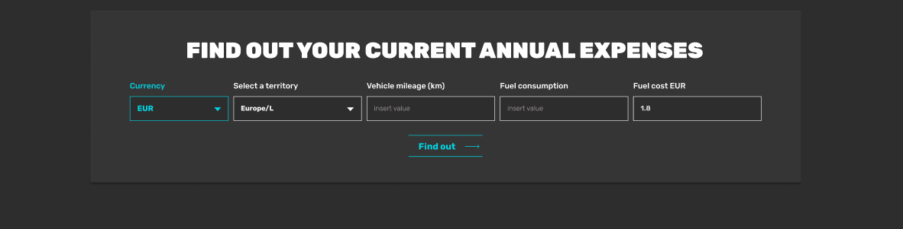

# sem_2_labs

## FORM
```
form>label+(select[type="text" name="input"]>option.option$*3)*2+(label+input[type="text" name="input"])*3+button[type="submit" value="Submit"]
```


## NAV
```
img.pic+nav.navigation>ul.navigation__list>li.navigation__list-item*6
```


## CARD
```
h2+ul.card>(li.card__list>p.card__list-item+button.button)*3
```


## FOOTER
```
footer.footer>(ul.footer__list>li.footer__list-item$*3)+p.footer__p
```
